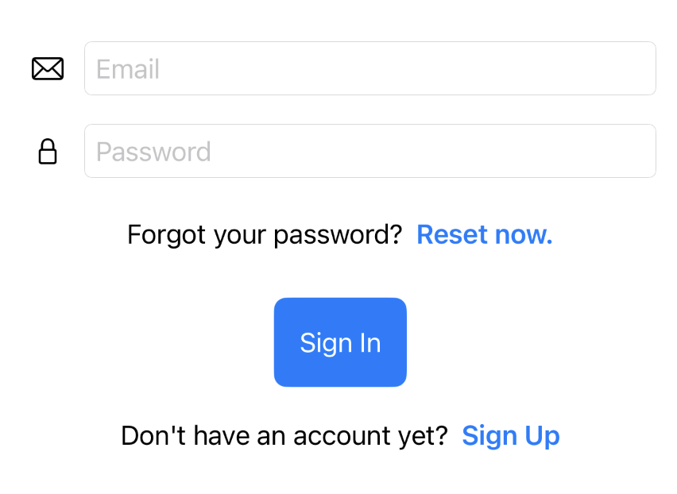

### This is a demo project of implementing Firebase Authentication into a SwiftUI project. You can get the tutorial from [DevSwiftly.com](https://devswiftly.com/add-firebase-authentication-to-your-swiftui-app/). 

Make sure to add your own GoogleService-Info.plist into the root directory of the project.  

